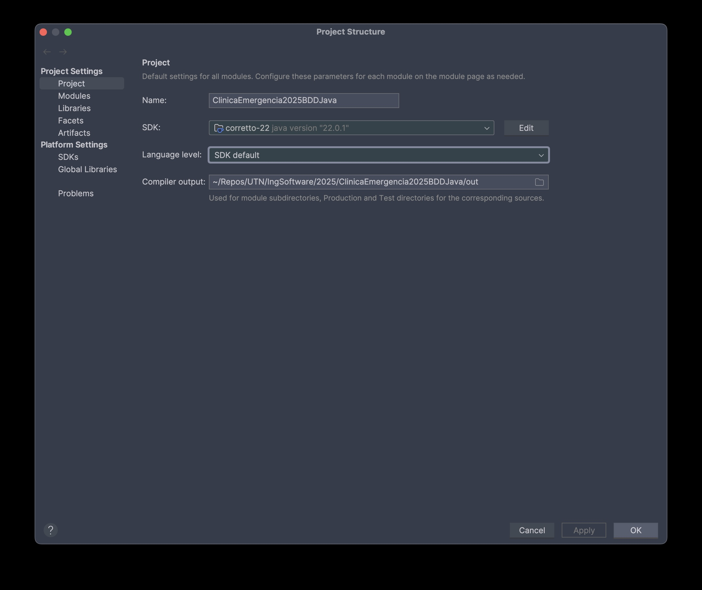
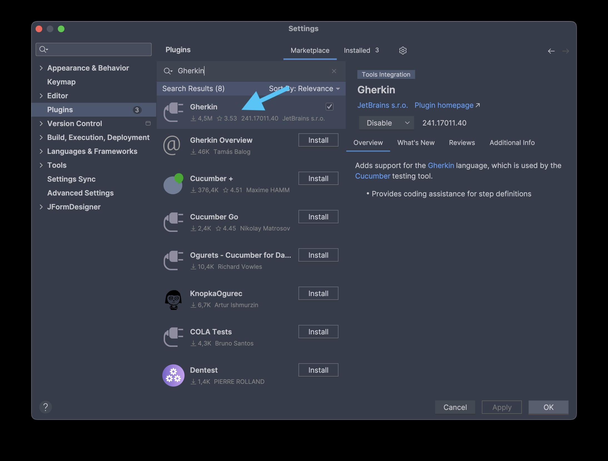

# Ing Software 2025: Ejemplo BDD con Java.

En resumen, este proyecto es el proyecto que vimos en clase.

## Requisitos
- SDK: Java Amazon Coretto 22.0.1
- Maven: Maven 3.9.11
- Opcional: Recomiendo usar [sdkman](https://sdkman.io) para administrar versiones de Java asi para instalar simplemente usan el comando:
  ```shell
  sdk install java 22.0.1-amzn;
  sdk install maven 3.9.11;
  ```

## Configuración del entorno
1. Clonar este repositorio
2. Abrir el proyecto en IntelliJIdea y esperar a que se indexe.
3. En `Project Settings` su configuración debe lucir de la siguiente forma:

4. Instalar el plugin de [Gherkin](https://plugins.jetbrains.com/plugin/9164-gherkin). Para eso pueden ir a la pestaña `Settings > Plugins` y buscarlo ahí.

5. Una vez obtenido todo eso, deberían poder correr sin problemas los tests de Gherkin.